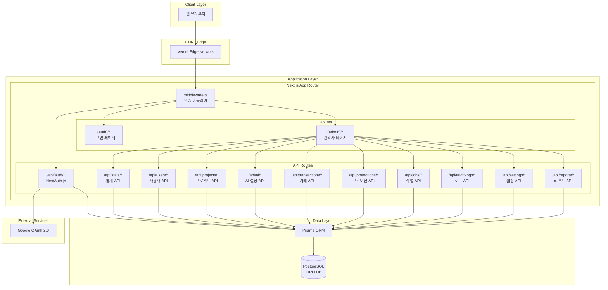
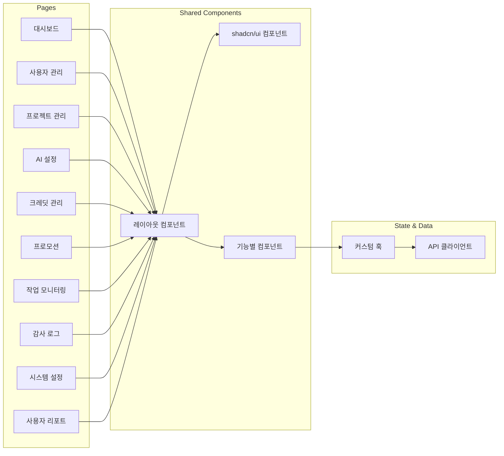
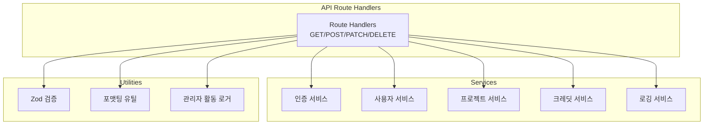
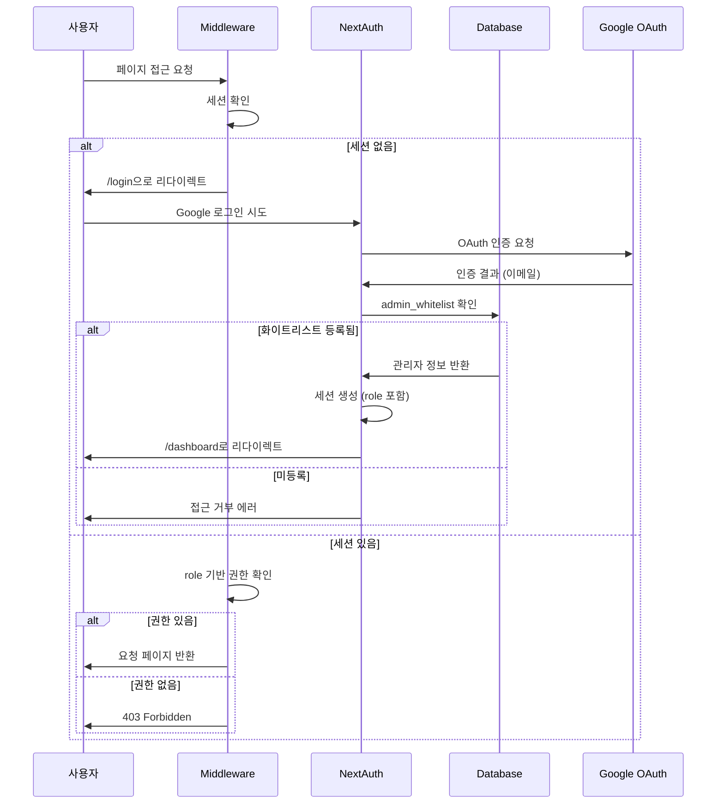
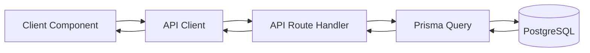
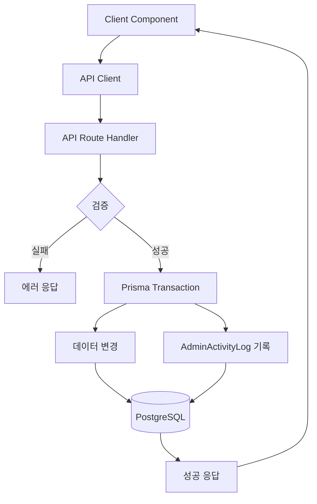
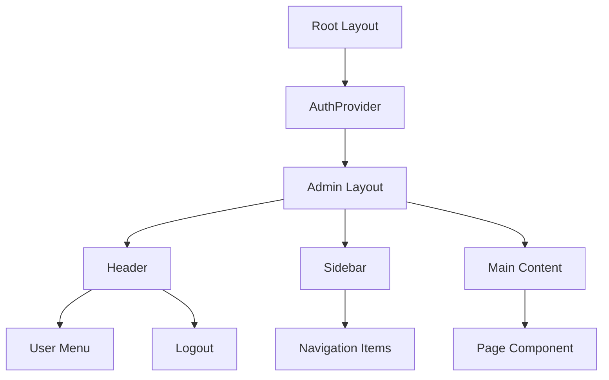
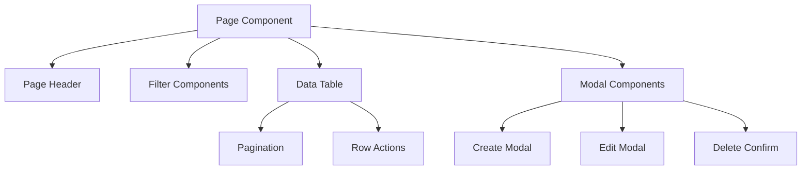
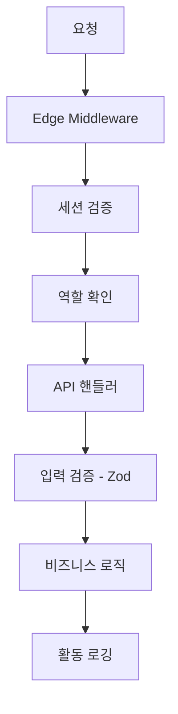

# TIRO Admin 시스템 아키텍처

> **문서 버전**: v1.0
> **최종 업데이트**: 2025-12-17
> **목적**: TIRO 관리자 사이트의 전체 시스템 아키텍처 및 컴포넌트 관계 정의

---

## 1. 시스템 개요

TIRO Admin은 TIRO 서비스(AI 기반 웹소설 작성 도구)의 운영 및 관리를 위한 별도의 관리자 전용 웹 애플리케이션입니다.

### 1.1 핵심 특징
- **독립 배포**: TIRO 메인 서비스와 별도의 프로젝트로 독립 배포
- **DB 공유**: 기존 TIRO PostgreSQL 데이터베이스 공유 (읽기/쓰기)
- **화이트리스트 인증**: Google OAuth + 이메일 화이트리스트 기반 접근 제어
- **역할 기반 권한**: ADMIN / SUPER_ADMIN 역할 구분

---

## 2. 전체 아키텍처 다이어그램



---

## 3. 계층별 상세 구조

### 3.1 프레젠테이션 계층 (Presentation Layer)



### 3.2 비즈니스 로직 계층 (Business Logic Layer)



### 3.3 데이터 접근 계층 (Data Access Layer)

```mermaid
graph TB
    subgraph "Prisma Client"
        PrismaInstance[Prisma Client Instance]
    end

    subgraph "Models - TIRO 공유"
        User[User]
        Project[Project]
        Episode[Episode]
        CreditTransaction[CreditTransaction]
        AsyncJob[AsyncJob]
        AiCreditRate[AiCreditRate]
        AiProviderConfig[AiProviderConfig]
        PromotionCode[PromotionCode]
        AuditLog[AuditLog]
        UserReport[UserReport]
    end

    subgraph "Models - Admin 전용"
        AdminWhitelist[AdminWhitelist]
        AdminActivityLog[AdminActivityLog]
        SystemSetting[SystemSetting]
    end

    PrismaInstance --> User
    PrismaInstance --> Project
    PrismaInstance --> Episode
    PrismaInstance --> CreditTransaction
    PrismaInstance --> AsyncJob
    PrismaInstance --> AiCreditRate
    PrismaInstance --> AiProviderConfig
    PrismaInstance --> PromotionCode
    PrismaInstance --> AuditLog
    PrismaInstance --> UserReport
    PrismaInstance --> AdminWhitelist
    PrismaInstance --> AdminActivityLog
    PrismaInstance --> SystemSetting
```



---

## 4. 인증 및 권한 플로우



---

## 5. 디렉토리 구조

```
tiro-admin/
├── src/
│   ├── app/                          # Next.js App Router
│   │   ├── (auth)/                   # 인증 관련 페이지 (로그인)
│   │   │   ├── login/
│   │   │   └── layout.tsx
│   │   ├── (admin)/                  # 관리자 페이지 (보호됨)
│   │   │   ├── dashboard/
│   │   │   ├── users/
│   │   │   ├── projects/
│   │   │   ├── ai/
│   │   │   ├── credits/
│   │   │   ├── promotions/
│   │   │   ├── jobs/
│   │   │   ├── audit-logs/
│   │   │   ├── settings/
│   │   │   ├── reports/
│   │   │   └── layout.tsx
│   │   ├── api/                      # API Route Handlers
│   │   │   ├── auth/[...nextauth]/
│   │   │   ├── stats/
│   │   │   ├── users/
│   │   │   ├── projects/
│   │   │   ├── ai/
│   │   │   ├── transactions/
│   │   │   ├── promotions/
│   │   │   ├── jobs/
│   │   │   ├── audit-logs/
│   │   │   ├── settings/
│   │   │   └── reports/
│   │   ├── layout.tsx
│   │   └── globals.css
│   │
│   ├── components/
│   │   ├── ui/                       # shadcn/ui 컴포넌트
│   │   ├── layouts/                  # 레이아웃 컴포넌트
│   │   │   ├── AdminLayout.tsx
│   │   │   ├── Header.tsx
│   │   │   └── Sidebar.tsx
│   │   ├── features/                 # 기능별 컴포넌트
│   │   │   ├── dashboard/
│   │   │   ├── users/
│   │   │   ├── projects/
│   │   │   ├── ai/
│   │   │   ├── credits/
│   │   │   ├── promotions/
│   │   │   ├── jobs/
│   │   │   ├── logs/
│   │   │   ├── settings/
│   │   │   └── reports/
│   │   └── providers/                # Context Providers
│   │
│   ├── lib/
│   │   ├── auth/                     # 인증 관련
│   │   │   ├── config.ts             # NextAuth 설정
│   │   │   └── session.ts            # 세션 유틸리티
│   │   ├── db/
│   │   │   └── prisma.ts             # Prisma 클라이언트
│   │   ├── api/
│   │   │   ├── client.ts             # fetch 래퍼
│   │   │   └── response.ts           # API 응답 헬퍼
│   │   ├── utils/
│   │   │   ├── admin-logger.ts       # 관리자 활동 로깅
│   │   │   └── format.ts             # 포맷팅 유틸
│   │   ├── constants/                # 상수 정의
│   │   └── validators/               # Zod 스키마
│   │
│   ├── types/                        # TypeScript 타입 정의
│   │   ├── user.ts
│   │   ├── project.ts
│   │   ├── transaction.ts
│   │   ├── job.ts
│   │   ├── promotion.ts
│   │   └── admin.ts
│   │
│   └── hooks/                        # 커스텀 React 훅
│
├── prisma/
│   ├── schema.prisma                 # Prisma 스키마
│   └── migrations/
│
├── docs/                             # 문서
├── progress/                         # 진행 상황
├── middleware.ts                     # Next.js 미들웨어
└── ...설정 파일들
```

---

## 6. 데이터 흐름

### 6.1 읽기 작업 흐름



### 6.2 쓰기 작업 흐름 (활동 로깅 포함)



---

## 7. 주요 컴포넌트 관계

### 7.1 레이아웃 구조



### 7.2 페이지 컴포넌트 구조



---

## 8. 외부 시스템 연동

### 8.1 현재 연동

| 시스템 | 용도 | 연동 방식 |
|--------|------|----------|
| Google OAuth 2.0 | 관리자 인증 | NextAuth.js |
| PostgreSQL (TIRO DB) | 데이터 저장소 | Prisma ORM |
| Vercel | 호스팅/배포 | Git 연동 |

### 8.2 향후 연동 가능

| 시스템 | 용도 |
|--------|------|
| Slack/Discord | 알림 연동 |
| Email Service | 관리자 알림 |
| Analytics | 사용 통계 |

---

## 9. 보안 아키텍처

### 9.1 인증/인가

- **인증**: Google OAuth 2.0 + NextAuth.js
- **인가**: 역할 기반 접근 제어 (RBAC)
  - `ADMIN`: 일반 관리 기능
  - `SUPER_ADMIN`: 관리자 관리, 시스템 설정

### 9.2 보안 레이어



### 9.3 감사 로깅

모든 관리자 활동은 `admin_activity_logs` 테이블에 기록:
- 수행자 이메일
- 수행 액션
- 대상 타입/ID
- 변경 전/후 데이터 (JSON)
- IP 주소, User Agent
- 타임스탬프

---

## 10. 성능 고려사항

### 10.1 서버 사이드

- Prisma Connection Pool 관리
- 쿼리 최적화 (select, include 명시)
- 페이지네이션 적용

### 10.2 클라이언트 사이드

- React Server Components 활용
- 동적 import로 코드 스플리팅
- SWR/React Query 캐싱 (필요시)

---

## 11. 아키텍처 제약조건

### 11.1 필수 준수 사항

1. **데이터베이스 공유**: TIRO 메인 서비스와 동일한 DB 사용
2. **화이트리스트 인증**: 반드시 admin_whitelist 테이블 기반 인증
3. **활동 로깅**: 데이터 변경 시 반드시 AdminActivityLog 기록
4. **API 응답 형식**: 일관된 JSON 응답 구조 사용

### 11.2 금지 사항

1. TIRO 메인 서비스의 핵심 비즈니스 로직 중복 구현 금지
2. 사용자 비밀번호 직접 접근/수정 금지
3. 하드코딩된 인증 정보 금지

---

*이 문서는 시스템 변경 시 반드시 업데이트되어야 합니다.*
